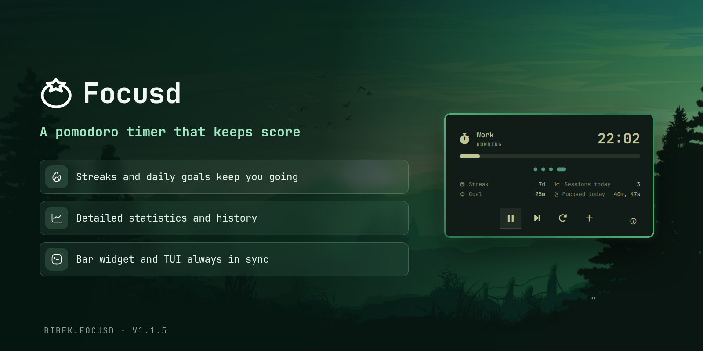

# Focusd for Omarchy

A circular Focusd pomodoro timer for the Omarchy bar. Shows the current phase
and remaining time as a progress ring, and opens a keyboard-driven control
panel when clicked.



## Requirements

- [Focusd](https://github.com/BibekBhusal0/focusd) installed and on `$PATH`
  (the daemon is started automatically by the CLI)

## Install

```bash
omarchy plugin add https://github.com/BibekBhusal0/omarchy-focusd.git --enable
```

## Use

The bar widget lands in the right section by default. Click it to open the
control panel.

| Button      | Action                          |
| ----------- | ------------------------------- |
| `` / ``   | Start or stop the current phase |
| `` / ``   | Pause or resume                 |
| `󰑒`         | Skip to the next phase          |

## Keyboard controls

With the panel open:

- Use the arrow keys or `h`, `j`, `k`, and `l` to select a button.
- Press Enter or Space to activate it.
- Press Escape to close the panel.
- Press Tab or Shift+Tab to move between bar panels.

You can also control the panel from a terminal or your own keybinding:

```bash
omarchy-shell shell toggle focusd
```

## Customize

Durations and presets are configured through Focusd itself:

```bash
focusd settings
```

## Uninstall

```bash
omarchy plugin remove focusd
```

## Credits

The bar widget design, `CircularProgress.qml`, panel, and keyboard-navigation
layout are adapted from [Omadoro](https://github.com/brianblakely/omadoro) by
Brian Blakely, licensed under the MIT License.
