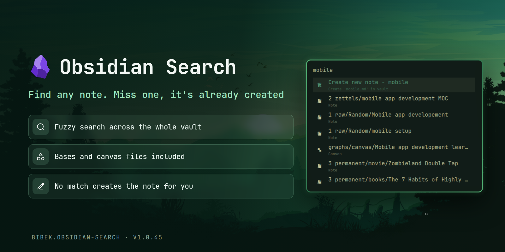

# Obsidian Search for Omarchy

A keyboard-first overlay for fuzzy-searching your [Obsidian](https://obsidian.md/)
vault. Type to filter notes with fuzzy ranking, open one with Enter, or create
a new note that isn't found.



## Requirements

- Obsidian with a vault configured at `~/.config/obsidian/obsidian.json`
- `fd` and `jq`

## Install

```bash
omarchy plugin add https://github.com/BibekBhusal0/omarchy-obsidian-search.git --enable
```

## Use

Bind the overlay to a key (Hyprland `~/.config/hypr/bindings.lua`):

```lua
o.bind("SUPER", "O", "exec, omarchy-shell shell summon obsidian-search")
```

- Type to fuzzy-filter the vault. Notes are ranked, not just substring-matched.
- `Enter` opens the selected note; `Escape` closes.
- When the query doesn't match a note, the first row creates
  `query.md` in the vault root.

## Uninstall

```bash
omarchy plugin remove obsidian-search
```

## Credits

Fuzzy matching uses [`FuzzySearch.js`](FuzzySearch.js), adapted from
[omarchy-raindrop-bookmarks](https://github.com/treramey/omarchy-raindrop-bookmarks)
by Trevor Ramey, licensed under the MIT License.

## License

This plugin is licensed under the [MIT License](../LICENSE).
