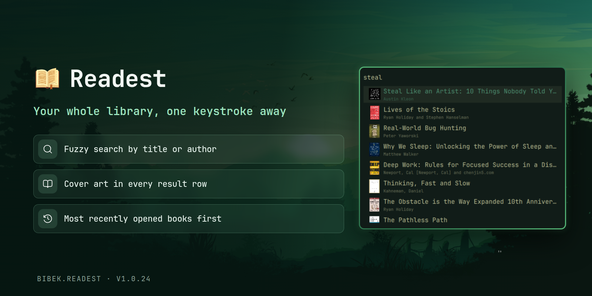

# Omarchy Shell Plugin for Readest

A beautiful [Readest](https://readest.com/) library search menu. Type to filter books by title or author with fuzzy ranking, and open one with Enter.



## Features

- Fuzzy search across your library by title or author, ranked by relevance
- Open books directly in Readest

## Requirements

- Omarchy quattro
- Readest
- `fd` and `jq` (preinstalled on Omarchy)

## Install

```bash
omarchy plugin add https://github.com/BibekBhusal0/omarchy-readest.git --enable
```

## Usage

Bind the menu to a key (`~/.config/hypr/bindings.lua`):

```lua
o.bind("SUPER", "R", "exec, omarchy-shell shell summon bibek.readest")
```

Type to filter, Enter opens the selected book in Readest, Escape closes.

## Configuration

The library is read from `~/.local/share/com.bilingify.readest/Readest/Books` by default. Override it under the plugin entry in `~/.config/omarchy/shell.json`:

```json
"plugins": [
  { "id": "bibek.readest", "libraryPath": "/path/to/your/books" }
]
```

## Uninstall

```bash
omarchy plugin remove bibek.readest
```

## Credits

Fuzzy matching uses [`FuzzySearch.js`](FuzzySearch.js), adapted from [omarchy-raindrop-bookmarks](https://github.com/treramey/omarchy-raindrop-bookmarks) by Trevor Ramey, licensed under the MIT License.

This plugin is licensed under the [MIT License](../LICENSE).

## Others

Here are my other Omarchy plugins:

- [Focusd](https://github.com/BibekBhusal0/omarchy-focusd) - pomodoro timer with streak, history and daily goal
- [Obsidian Search](https://github.com/BibekBhusal0/omarchy-obsidian-search) - fuzzy-search your Obsidian vault
- [Youtube Video Downloader](https://github.com/BibekBhusal0/omarchy-ytdl) - video downloads with progress and history

Please give a star if you find them useful!
